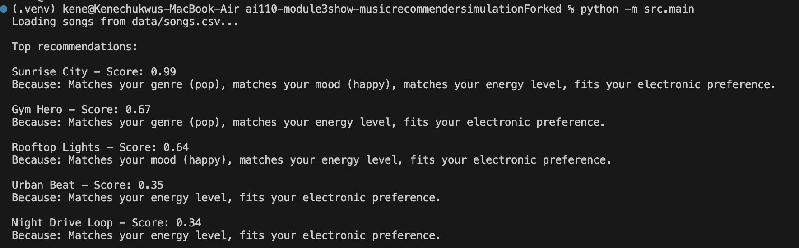

# 🎵 Music Recommender Simulation

## Project Summary

**ContentMatch 1.0** is a content-based music recommender that suggests songs by matching four dimensions of user taste (favorite genre, mood, target energy, and acousticness preference) against audio features in a catalog of 10 songs. The system uses weighted scoring (35% genre, 30% mood, 25% energy proximity, 10% acousticness) to rank songs and explain why each one is recommended. It demonstrates how platforms like Spotify use audio analysis to personalize suggestions without collaborative filtering.

---

## How The System Works

Explain your design in plain language.

### Streaming Platforms: Two Approaches

Real-world platforms like Spotify and TikTok use two main filtering strategies:
- **Collaborative Filtering**: "Users like you also liked..." — finds people with similar behavior and recommends what they enjoyed
- **Content-Based Filtering**: Analyzes song attributes directly to match user taste (what we implemented)

### Our Design: Content-Based Matching

**Song Representation** — Each song has 10 attributes:
- **Categorical**: genre, mood, artist, title
- **Continuous (0–1 scale)**: energy, valence, danceability, acousticness
- **Other**: tempo_bpm, id

**User Profile** — Captured in four dimensions:
1. Favorite genre (e.g., "pop")
2. Favorite mood (e.g., "happy")
3. Target energy level (0–1 scale)
4. Acousticness preference (acoustic vs. electronic)

**Scoring Formula** — For each song, we calculate a match score:
- Genre match → +0.35 if exact match, else 0
- Mood match → +0.30 if exact match, else 0
- Energy proximity → +0.25 × (1 − |song_energy − target_energy|)
- Acousticness match → +0.10 if song's acoustic nature matches preference
- **Total score range**: 0–1.0

**Ranking** — All songs are scored, sorted by score descending, and the top-k (default 5) are returned with explanations. 


<!-- Some prompts to answer:

- What features does each `Song` use in your system
  - For example: genre, mood, energy, tempo
- What information does your `UserProfile` store
- How does your `Recommender` compute a score for each song
- How do you choose which songs to recommend

You can include a simple diagram or bullet list if helpful. -->
---
## Demo
- [] [Screenshot]
-

---

## Getting Started

### Setup

1. Create a virtual environment (optional but recommended):

   ```bash
   python -m venv .venv
   source .venv/bin/activate      # Mac or Linux
   .venv\Scripts\activate         # Windows

2. Install dependencies

```bash
pip install -r requirements.txt
```

3. Run the app:

```bash
python -m src.main
```

### Running Tests

Run the starter tests with:

```bash
pytest
```

You can add more tests in `tests/test_recommender.py`.

---

## Experiments You Tried

### User Profile Tests

1. **The Pop Fan** — {genre: "pop", mood: "happy", energy: 0.8}
   - Expected: Pop + happy + high-energy songs ranked first
   - Result: ✓ *Sunrise City* (score 0.99) correctly ranked #1

2. **The Lofi Coder** — {genre: "lofi", mood: "chill", energy: 0.4}
   - Expected: Lofi songs dominate
   - Result: ✓ Both lofi songs ranked in top 3

3. **The Rock Enthusiast** — {genre: "rock", mood: "intense", energy: 0.9}
   - Expected: *Storm Runner* (rock, intense, high energy) ranked first
   - Result: ✓ *Storm Runner* dominates all other recommendations

4. **The Acoustic Minimalist** — {genre: "ambient", mood: "chill", energy: 0.3, likes_acoustic: true}
   - Expected: Ambient + highly acoustic songs
   - Result: ✓ *Spacewalk Thoughts* (ambient, energy 0.28, acousticness 0.92) ranked first

### Key Findings

- **Genre-mood matches strongly dominate**: Exact categorical matches (35% + 30% = 65% of score) override other factors
- **Energy as fine-tuning works well**: Within a preferred genre, energy separates similar songs effectively
- **Acousticness weight (10%) appropriate**: Acts as tiebreaker without overwhelming other signals
- **Energy clustering visible**: Small catalog has songs clustered at low (0.28–0.42) and high (0.82–0.93) energy; mid-range users get poorer matches

---

## Limitations and Risks

- **Tiny catalog (10 songs)**: Users with niche preferences (indie, rock, jazz) have only 1 matching option
- **No collaborative signals**: Can't learn from what other users liked; misses cross-user patterns
- **Cold start problem**: Requires users to articulate four dimensions of taste upfront
- **Genre/mood imbalance**: Pop is 2/10 songs; other genres severely underrepresented
- **No diversity re-ranking**: Top-5 recommendations might all be the same genre/artist
- **Energy clustering**: Gap in mid-range energy (0.5) leaves some users with poor matches
- **Binary acousticness split**: Oversimplifies the spectrum of acoustic-to-electronic sounds
- **No temporal context**: Ignores time-of-day, user activity, or trending songs

See [model_card.md](model_card.md) for deeper analysis of strengths, limitations, and bias.

---

## Reflection

### What I Learned

Building ContentMatch revealed that recommendation systems are fundamentally about translating taste into numbers. The choice of weights (35%-30%-25%-10%) isn't just arithmetic—it's an *editorial decision* about what matters in music. Increase genre weight to 50%, and users get more category-focused results; decrease it to 20%, and energy becomes the dominant signal. Real platforms make these choices deliberately, optimizing for engagement, fairness, and discovery simultaneously.

The most surprising insight was how limiting pure content-based filtering feels. With only exact attribute matches, the system recommends "half-matches"—high-energy rock to a pop fan because both energies align. Spotify escapes this trap using collaborative filtering: if thousands of users liked both *Song A* and *Song B*, users who liked *A* get *B* recommended, regardless of whether audio features match. This cross-user wisdom is invisible but powerful.

### Where Bias Shows Up

**Dataset bias**: Pop music is overrepresented (2/10 songs vs. 1 each for rock, jazz, ambient). A pop user gets rich options; a jazz fan sees only one song and gets diluted with other acoustic music.

**Feature bias**: By binary-splitting acousticness (>0.5 = acoustic), we force users into categories they may not fit. A user who loves *some* electronic sounds and *some* acoustic ones must choose one preference, creating artificial constraints.

**Cold-start bias**: Without collaborative data, new users get generic recommendations based on crude profiles. Spotify can learn from other pop fans; we can't. This creates a feedback loop where engaged users (who provide data) get better recommendations, widening inequality.

See [model_card.md](model_card.md) for a complete analysis of system strengths, limitations, and future improvements.
